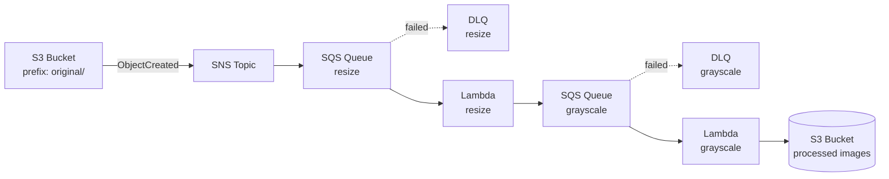

# S3 → SNS → SQS → Lambda Fan-out

S3 へのファイルアップロードをトリガーに、SNS → SQS → Lambda をファンアウトさせて  
**画像のリサイズ／グレースケール** と **ぼかし／回転** を段階的に処理する CDK

- **resize 系フロー**  
  `S3 put` → `S3 Event` → `SNS` → `SQS(resize)` → `Lambda(resize)` → `SQS(grayscale)` → `Lambda(grayscale)` → `S3 put`

- **blur 系フロー**  
  `S3 put` → `S3 Event` → `SNS` → `SQS(blur)` → `Lambda(blur)` → `SQS(rotate)` → `Lambda(rotate)` → `S3 put`

---

## アーキテクチャ

### Resize / Grayscale パイプライン

### Blur / Rotate パイプライン

